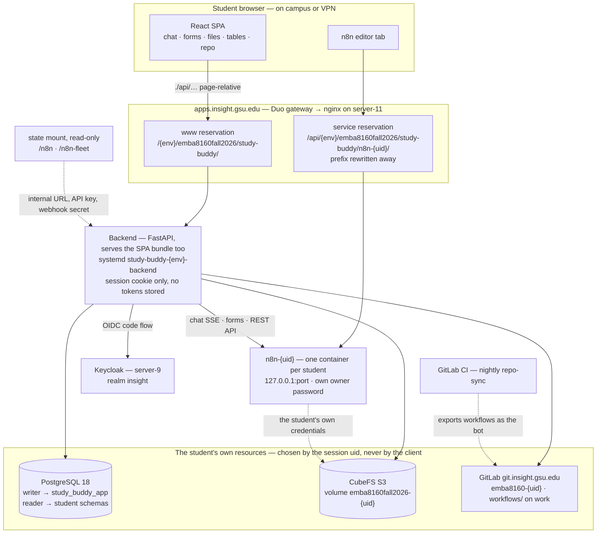

The shared framework for EMBA 8160 (Fall 2026). Each student designs their own AI study buddy in their own n8n instance. This application supplies the user interface and the resources around it: chat, forms, files (CubeFS), database (PostgreSQL) and GitLab sync.
<!--more-->

<!-- | Environment | Branch | URL |
|---|---|---|
| dev | `develop` | https://apps.insight.gsu.edu/dev/emba8160fall2026/study-buddy/ |
| prod | `main` | https://apps.insight.gsu.edu/emba8160fall2026/study-buddy/ | -->

> **The site are reachable on campus or over the VPN only!**

> **Documentation at [n8n Documentation](../n8n-documentation/)**

| Site | URL |
|------|-----|
| Study-Buddy | https://apps.insight.gsu.edu/emba8160fall2026/study-buddy/ |
| GitLab | https://git.insight.gsu.edu/ |
| PostreSQL | https://www.insight.gsu.edu/adminer/?pgsql=storage%3A5432&db=emba8160fall2026 |
| Create Ollama API keys on ARC | https://www.insight.gsu.edu/a/ |
| Jupyter Lab and Terminal | https://arc.insight.gsu.edu/ |

**Additional Links:**
- [Institute for Insight
Computing Resources (ARC)](https://www.insight.gsu.edu/)
- [Chnage your ARC password](https://www.insight.gsu.edu/z/)
- [GSU Virtual Private Network (VPN)](https://technology.gsu.edu/technology-services/cybersecurity/virtual-private-network/)
- [O'Reilly via GSU Library](https://go.oreilly.com/georgia-state-university/home/)

***

## User Interface

### Study Buddy



The browser-based application manages the resources of the agentic system behind a simple user interface.

### n8n — Agentic Workflow Designer



The n8n framework provides the environment in which students implement agentic workflows.

***

## Architecture

One backend deployment serves everyone, and every resource it touches is derived from the session uid,
never from the client. Below, `{uid}` is the LDAP username and `{env}` the environment: the app's own path
drops it on prod (`/emba8160fall2026/study-buddy/`), the `/api/…` paths always carry it.

- **One origin.** nginx forwards the app's full path unstripped and `ProxyPrefixMiddleware` handles it,
  so the SPA calls `./api/…` and the bundle carries no baked-in URL.
- **n8n is never exposed directly.** Instances listen on `127.0.0.1` only; the browser reaches the editor
  through the gateway, and the backend reaches the instance over the podman network
  (`http://study-buddy-{env}-n8n-{uid}:5678`). The dev/staff instance is `n8n-test` in env `dev`;
  the student fleet lives in env `fleet`.
- **Nothing about a conversation is kept.** The chat relay stores and logs no message text, form values
  or replies, and no file name, repository path or SQL appears in logs or audit rows.
